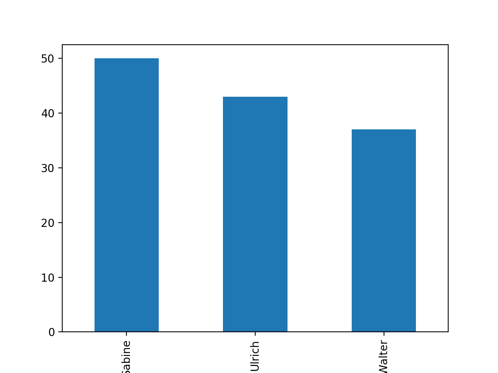
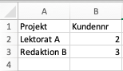
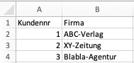
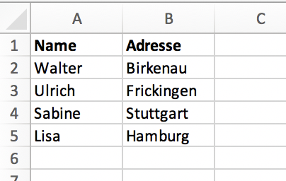
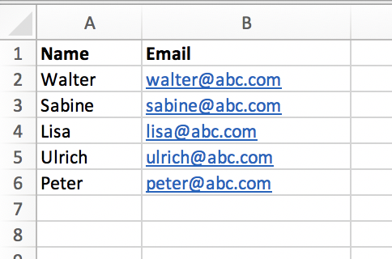
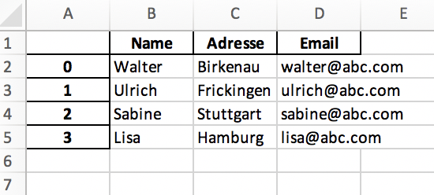
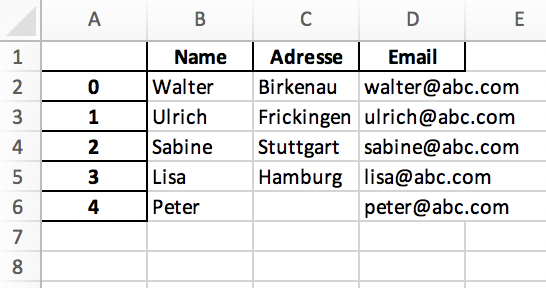
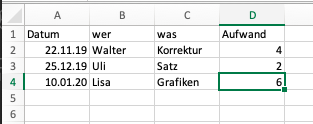

# Mit Excel arbeiten
## Motivation
Excel ist ein großartiges Programm, aber ...

Gefunden auf [dataquest.io](https://www.dataquest.io/blog/excel-vs-python/):

> Why Use Python vs Excel?
> 
> 1. You can read and work with almost any kind of data.
> 2. Automated and repetitive tasks are easier.
> 3. Working with large data sets is much faster and easier.
> 4. It’s easier for others to reproduce and audit your work.
> 5. Finding and fixing errors is easier.
> 6. Python is open source, so you can see what’s behind the libraries you use.
> 7. Advanced statistics and machine learning capabilities.
> 8. Advanced data visualization capabilities.
> 9. Cross-platform stability — your analysis can be run on any computer.


Man muss sich auch gar nicht für das eine oder andere entscheiden – Python und Excel arbeiten zusammen.

## Pandas
[Pandas](https://pandas.pydata.org) ist ein mächtiges Python-Modul für Datenanalyse, Statistik usw. Die Installation erfolgt per `pip`:
```
$ pip install pandas
```

Falls man Excel-Dateien mit Pandas einlesen will, sollte man auch **xlrd** installieren:
```
$ pip install xlrd
```

### Daten einlesen
Zur Demonstration verwenden wir eine kleine csv-Datei _mitarbeiter.csv_: 
```
Vorname,Nachname,Firma,Datum,Jan,Feb,Mar
Ulrich,Kilian,science & more,2018-07-01,30,70,40 
Walter,Greulich,wgv,2018-08-15,20,35,46
Max,Manta,ABC,2019-01-01,,10,15
Lisa,Lorbeer,,2018-11-10,20,,10
```
Sie wird zunächst eingelesen:
```
>>> import pandas as pd
>>> staff = pd.read_csv('mitarbeiter.csv')
>>> staff
  Vorname  Nachname           Firma       Datum   Jan   Feb  Mar
0  Ulrich    Kilian  science & more  2018-07-01  30.0  70.0   40
1  Walter  Greulich             wgv  2018-08-15  20.0  35.0   46
2     Max     Manta             ABC  2019-01-01   NaN  10.0   15
3    Lisa   Lorbeer             NaN  2018-11-10  20.0   NaN   10
```

Ich kann auch die entsprechende Excel-Datei einlesen per `read_excel()`. Das führt zum gleichen Ergebnis:
```
>>> staff = pd.read_excel('mitarbeiter.xlsx')
>>> staff
  Vorname  Nachname           Firma      Datum   Jan   Feb  Mar
0  Ulrich    Kilian  science & more 2018-07-01  30.0  70.0   40
1  Walter  Greulich             wgv 2018-08-15  20.0  35.0   46
2     Max     Manta             ABC 2019-01-01   NaN  10.0   15
3    Lisa   Lorbeer             NaN 2018-11-10  20.0   NaN   10
```
Man sieht:
* Die Einträge der ersten Zeile werden als Spaltennamen interpretiert.
* Die Zählung der Datensätze beginnt bei 0.
* Zahlen werden zu _Floats_.
* Fehlende Daten (leere Zellen) werden mit "NaN" gefüllt.

Die Variable _staff_, die die Daten enthält, ist ein sogenanntes _DataFrame_:
```
>>> type(staff)
<class 'pandas.core.frame.DataFrame'>
```

### Daten sortieren und auswerten
Man sortiert ein _DataFrame_ mit der Methode `sort_values()`:
```
>>> staff = staff.sort_values('Datum')
>>> staff
  Vorname  Nachname           Firma       Datum   Jan   Feb  Mar
0  Ulrich    Kilian  science & more  2018-07-01  30.0  70.0   40
1  Walter  Greulich             wgv  2018-08-15  20.0  35.0   46
3    Lisa   Lorbeer             NaN  2018-11-10  20.0   NaN   10
2     Max     Manta             ABC  2019-01-01   NaN  10.0   15
```
Um die Summe der Spalten Jan, Feb und Mar zu bilden (man könnte sich Aufwände vorstellen), würde man in Excel eine weitere Spalte anlegen und in dieser Summen wie `sum(E2:G2)` usw. bilden. In **Pandas** fast man zunächst die Spalten, die addiert werden sollen, in einer Liste zusammen:
```
>>> aufwand_spalten = staff[["Jan","Feb", "Mar"]]
>>> aufwand_spalten
    Jan   Feb  Mar
0  30.0  70.0   40
1  20.0  35.0   46
3  20.0   NaN   10
2   NaN  10.0   15
```
Dann fügt man quasi der Tabelle eine weitere Spalte hinzu, in der zeilenweise (`axis=1`) addiert wird:
```
>>> staff["aufwand_gesamt"] = aufwand_spalten.sum(axis=1)
>>> staff
  Vorname  Nachname           Firma       Datum   Jan   Feb  Mar  aufwand_gesamt
0  Ulrich    Kilian  science & more  2018-07-01  30.0  70.0   40           140.0
1  Walter  Greulich             wgv  2018-08-15  20.0  35.0   46           101.0
3    Lisa   Lorbeer             NaN  2018-11-10  20.0   NaN   10            30.0
2     Max     Manta             ABC  2019-01-01   NaN  10.0   15            25.0
```

### Daten gruppieren
Angenommen, man hat eine Liste _projektverwaltung.csv_ mit Namen, Projekten und Aufwänden:
```
Name,Projekt,Aufwand
Ulrich,ABC,10
Ulrich,Oha,20
Walter,ABC,15
Ulrich,ABC,3
Sabine,Oha,30
Walter,Oha,2
Sabine,Oha,20
Ulrich,Oha,10
Walter,ABC,20
```
Man möchte sie nach Namen und Projekt auswerten und über Aufwand summieren:
```python
>>> df = pd.read_csv('Excel/projektverwaltung.csv')
>>> df
     Name Projekt  Aufwand
0  Ulrich     ABC       10
1  Ulrich     Oha       20
2  Walter     ABC       15
3  Ulrich     ABC        3
4  Sabine     Oha       30
5  Walter     Oha        2
6  Sabine     Oha       20
7  Ulrich     Oha       10
8  Walter     ABC       20
>>> df.groupby(["Name", "Projekt"]).Aufwand.sum()
Name    Projekt
Sabine  Oha        50
Ulrich  ABC        13
        Oha        30
Walter  ABC        35
        Oha         2
Name: Aufwand, dtype: int64
```
Oder:
```python
>>> df.groupby(["Name"]).Aufwand.sum()
Name
Sabine    50
Ulrich    43
Walter    37
```
Auch Plotten ist sehr einfach mit **Pandas** und **matplotlib.plot**:
```python
>>> import matplotlib.pyplot as plt
>>> df.groupby(["Name"]).Aufwand.sum().plot(kind='bar')
<matplotlib.axes._subplots.AxesSubplot object at 0x11b91e750>
>>> plt.show()
```




### Tabellen verknüpfen: Merge, Joins
In Excel kann man Tabellenblätter mit einem `SVERWEIS(...)` verknüpfen. Ein typischer Fall:

* Tabelleblatt 1 enthält Projekte, die Kundennummern zugeordnet sind:
  
  
* Tabellenblatt 2 enthält Kundendaten zu den Kundennummern:

  

Um jetzt in Excel im Tabellenblatt 1 in Spalte C den Firmennamen zu platzieren, würde man im Feld C2 einen _S-Verweis_ von Feld B2 auf die gesamte Tabelle in Tabellenblatt 2 anlegen, wobei Spalte 2 in Tabellenblatt 1 abgezeigt werden soll: 
```
=SVERWEIS(Tabelle1!B2;Tabelle2!A1:B4;2)
```
In Python würde man zwei csv-Dateien einlesen:
```
>>> projekte = pd.read_csv('projekte.csv')
>>> projekte
       Projekt  Kundennr
0   Lektorat A         2
1  Redaktion B         3
>>> kunden = pd.read_csv('kunden.csv')
>>> kunden
   Kundennr           Firma
0         1      ABC-Verlag
1         2      XY-Zeitung
2         3  Blabla-Agentur
```
Dann führt man mit der Funktion `pd.merge()` die beiden _DataFrames_ zusammen; `how='left'` gibt an, dass man das für alle Zeilen der linken (ersten) Tabelle machen möchte:
```
>>> kundenprojekte = pd.merge(projekte, kunden, how='left', on='Kundennr')
>>> kundenprojekte
       Projekt  Kundennr           Firma
0   Lektorat A         2      XY-Zeitung
1  Redaktion B         3  Blabla-Agentur
```

### Merging von Exceldateien

Eion weiteres Beispiel: Mithilfe von **pandas** lassen sich auch Excel-Listen auf recht einfache Weise verknüpfen.

Beispiel:

- Die Datei _adressen.xlsx_ enthält Namen und Adressen:
  
- Die Datei _emails.xlsx_ enthält Namen udn Emails:
  

Ziel: beide Dateien in einer zusammenführen mit 3 Spalten _Name_, _Adresse_, _Email_.

Die Zusammenführung erfolgt auch hier mit der Methode `merge()`. In unserem Fall ist ein _Merge_ auf die Spalte _Name_ sinnvoll, d.h. die Spalte _Name_ verknüpft (_join_) die beiden Tabelle. Dabei muss man entscheiden, wie man die Dateien _mergen_ soll:

- nur die Datensätze zu _Name_, wenn _Name_ in beiden Tabellen vorhanden ist (_inner join_ = Schnittmenge)
- alle Datensätze aus der ersten Tabelle (_left join_)
- alle Datensätze aus der zweiten Tabelle (_right join_)

Das folgende Skript zeigt alle drei _joins_:
```python
# merge.py

import pandas as pd

df_adressen = pd.read_excel("adressen.xlsx")
df_emails = pd.read_excel("emails.xlsx")

inner_join_df = df_adressen.merge(df_emails, how="inner", on="Name")
left_join_df = df_adressen.merge(df_emails, how="left", on="Name")
right_join_df = df_adressen.merge(df_emails, how="right", on="Name")


inner_join_df.to_excel("adressen_und_emails.xlsx")
left_join_df.to_excel("alle_adressen_und_emails.xlsx")
right_join_df.to_excel("adressen_und_alle_emails.xlsx")
```

Die Dateien _adressen_und_emails.xlsx_ (_inner join_) und _alle_adressen_und_emails.xlsx_ (_left join_) enthalten nur die Datensätze zu den Namen, die in _adressen.xlsx_ und _emails.xlsx_ vorhanden sind:



Die Datei _adressen_und_alle_emails.xlsx_ (_right join_) zeigt auch den Datensatz zu Peter; das Feld _Adresse_ bleibt leer:




### If-Statements, Pivot
((fehlt))

### Daten vergleichen
**Pandas** bietet sehr viele Möglichkeiten, mit _DataFrames_ zu arbeiten. Als Beispiel ist hier gezeigt, wie sich zwei Excel-Tabellen vergleichen lassen. Beide haben die gleiche Struktur, aber unterschiedliche Zahlenwerte:
```
>>> df1 = pd.read_excel('aufwand_01.xlsx')
>>> df1
  Unnamed: 0   Jan  Feb  Mar  Aprl  Jun  Jul
0     Monika  10.0   22   10     5    0   10
1       Lisa  15.0   17    0     2    5   15
2     Ulrich  30.0   16   10    10   20   15
3     Walter  44.0   11   44    15   18    5
4      Jutta  10.0    0   24    15   14    7
5  Christian   NaN   67    0    10   10   14
>>> df2 = pd.read_excel('aufwand_02.xlsx')
>>> df2
  Unnamed: 0  Jan  Feb  Mar  Aprl  Jun  Jul
0     Monika   10   22   10   5.0    0   10
1       Lisa   15   17    0   2.0    5   15
2     Ulrich   30   18   10  10.0   10   15
3     Walter   44   11   44  15.0   18    5
4      Jutta   10    0   24  20.0   14    7
5  Christian    5   67    0   NaN   10   14
```
Die Pandas-Funktion `equals()` vergleicht _df1_ mit _df2_:
```  
>>> df1.equals(df2)
False
```
Das zeigt zweierlei:

1. _df1_ und _df2_ sind vergleichbar, sonst würde hier ein Fehler auftreten.
2. Die Inhalte von _df1_ und _df2_ unterscheiden sich.
   
Der eigentliche Vergleich nutzt den Vergleichsoperator `==` und weist das Ergebnis einer Variablen zu:
```
>>> vergleich = df1.values == df2.values
>>> vergleich
array([[ True,  True,  True,  True,  True,  True,  True],
       [ True,  True,  True,  True,  True,  True,  True],
       [ True,  True, False,  True,  True, False,  True],
       [ True,  True,  True,  True,  True,  True,  True],
       [ True,  True,  True,  True, False,  True,  True],
       [ True, False,  True,  True, False,  True,  True]])
```
Diese Matrix zeigt, in welchen Zellen Unterschiede auftreten. Um sie herauszufiltern, bietet zum Beispiel die Python-bibliothek **MumPy** einfache Möglichkeiten, mehrdimensionale Objekte (Vektoren, Matrizen, Arrays) zu vergleichen. **NumPy** gehört nicht zur Standard-Bibliothek und muss installiert werden:
```
$ pip install numpy
```
Der folgende Code filtert genau die Zellen aus dem Vergleichsarry heraus:
```
>>> import numpy
>>> rows,cols = numpy.where(vergleich==False)
```
_rows_ und _cols_ enthalten die Zeilen- und Spaltenindizes der _False_-Zellen:
```
>>> rows
array([2, 2, 4, 5, 5])
>>> cols
array([2, 5, 4, 1, 4])
```

Jetzt könnte man z.B. in _df1_ in diesen Zellen den alten Wert durch "alter Wert --> neuer Wert" ersetzen. Normalerweise müsste man zwei _for_-Schelifen konstruieren, um über zwei Arrays zu iterieren. Die wunderbare Python-Methode `zip()` erledigt das in einem Schritt und iteriert gleichzeitig durch _rows_ und _cols_:
```
>>> for item in zip(rows,cols):
...     df1.iloc[item[0],item[1]] = '{} --> {}'.format(df1.iloc[item[0],item[1]],df2.iloc[item[0],item[1]])
```
Die Methode `iloc()` indiziert _df1_ anhand von Zeilen- und Spaltenindex (man könnte auch - wie in Excel - Spalten- und Zeilentitel nehmen). Die Methode `format()` ermöglicht formatierte Ausgaben mit Platzhaltern:
```
>>> '{} --> {}'.format(10,20)
'10 --> 20'
>>> '{} trifft sich mit {}'.format('Ulrich','Walter')
'Ulrich trifft sich mit Walter'
```
_df1_ sieht jetzt so aus:
```
>>> df1
  Unnamed: 0        Jan        Feb  Mar         Aprl        Jun  Jul
0     Monika         10         22   10            5          0   10
1       Lisa         15         17    0            2          5   15
2     Ulrich         30  16 --> 18   10           10  20 --> 10   15
3     Walter         44         11   44           15         18    5
4      Jutta         10          0   24  15 --> 20.0         14    7
5  Christian  nan --> 5         67    0   10 --> nan         10   14
```
Mit der Methode `to_excel()` schreibt man das Ergebnis z.B. in eine neue Excel-Datei:
```
df1.to_excel('aufwand_comp.xlsx',index=False,header=True)
```
`index=False` stellt sicher, dass die Index-Spalte von _df1_ nicht in die Excel-Datei geschrieben wird. Mit `header=True` wird hingegen der Header von _df1_ übernommen.


## Modul openpyxl
Ein Modul, mit dem man Excel-Dateien direkt lesen kann, ist **openpyxl**. Es muss zunächst installiert werden:
```
$ pip install openpyxl
```
**openpyxl** benutzt folgende Nomenklatur:

* _Workbook_: Die Excel-Datei
* _Worksheet_, _Sheet_: ein Tabellenblatt
* _Column_, _Row_, _Cell_: Spalte, Zeile, Zelle

Anhand der kleinen Beispieldatei _beispiel.xlsx_ wird der grunsätzliche Ablauf gezeigt:



1. Excel-Datei einlesen:
   ```
   >>> import openpyxl
   >>> wb = openpyxl.load_workbook('beispiel.xlsx')
   ```
2. Tabellenblatt wählen:
   ```
   >>> sheet = wb['Tabelle1']
   ```
   Falls ich die Namen der Tabellenblätter nicht kenne, kann ich sie mir ausgeben lassen:
   ```
   >>> wb.sheetnames
   ['Tabelle1']
   ```
3. Zelle in der Tabelle ansprechen:
   ```
   >>> sheet['A1']
   <Cell 'Tabelle1'.A1>
   ```
   Hier wird nur der Objekttyp zurückgegeben; den Inhalt der Zelle liefert
   ```
   >>> sheet['A1'].value
   'Datum'
   >>> sheet['A2'].value
   datetime.datetime(2019, 11, 22, 0, 0)
   ```
   Openpyxl erkennt also, dass in A2 ein Datum steht.

   Statt Ansprechen der Zelle mit ihren Excel-Koordinaten A1, A2 usw. kann auch die Methode `cell()` verwendet werden. Das eigent sich auch besser zum Automatiseren in Loops etc.
   ```
   >>> sheet.cell(row=2,column=1).value
   datetime.datetime(2019, 11, 22, 0, 0)
   >>> for i in range(1,5,1):
   ...     print(i, sheet.cell(row=i,column=2).value)
   1 wer
   2 Walter
   3 Uli
   4 Lisa
   ```

Mit **openpyxl** kann man auch in Excel-Dateien (sprich: _Workbooks_) schreiben:
```
>>> sheet['B5'] = 'Monika'
>>> sheet['B5'].value
'Monika'
>>> from datetime import date
>>> sheet['A5'] = datetime.date.today()
>>> sheet['A5'].number_format = 'DD.MM.YY'
>>> sheet['C5'] = 'Lektorat'
>>> sheet['D5'] = 8
>>> wb.save('beispiel_Kopie.xlsx')
```
Wichtig ist die `save()`-Methode am Ende. Die Sache mit den Datumsangaben ist ein bisschen tricky: `datetime.date.today()` liefert zwar das Datum, aber zusätzlich muss das gewünschte `number_format` angegeben werden, mit dem die Zelle in Excel formatiert werden soll.


