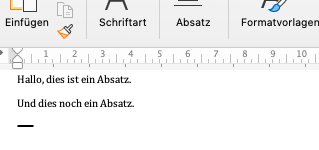
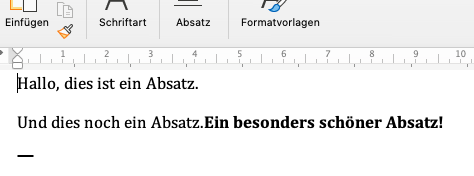
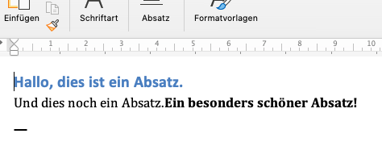
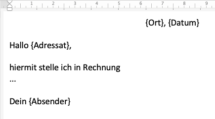
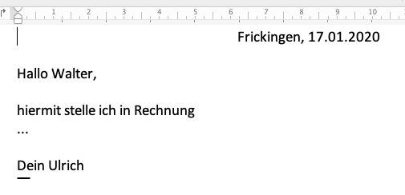

# Word-Dateien bearbeiten
Mit Python kann man .docx-Dateien lesen und bearbeiten. Es gibt ein eigenes Modul dafür: **docx**. Es wird mit `pip` (oder `pipenv`) installiert:
```python
$ pip install python-docx
```
(Hinweis: Es muss `python-docx` installiert werden, in einem Python-Programm wird aber `docx` importiert.)

## Lesen von Word-Dateien
Das folgende Skript importiert das Modul **docx**, öffnet das Dokument _test\_01.docx_ als Objekt `doc` vom Typ `Document`, erzeugt eine Liste der Absätze und gibt die Länge dieser Elemente (also die Anzahl der Listen-Elemente) aus.
Das erste Element (Index 0) dieser Liste ist der erste Absatz. Die Methode `text` gibt den Text dieses Absatzes zurück.
```python
# zaehle_absaetze.py

import docx

doc = docx.Document('test_01.docx')

liste_der_absaetze = doc.paragraphs
anzahl_absaetze = len(liste_der_absaetze)
erster_absatz = liste_der_absaetze[0]
text_erster_absatz = erster_absatz.text

print(f"Das Dokument hat {anzahl_absaetze} Absätze.")
print(f"Der erste Absatz lautet: {text_erster_absatz}")
```
Das bedeutet: Das Paket **docx** stellt ein Objekt `docx.Document()` zur Verfügung, mit dem sich Word-Dateien öffnen lassen. Die Liste `paragraphs` enthält dann eine Liste der Absätze. Das Element mit Index 0 in dieser Liste ist der erste Absatz. Seinen Textinhalt liefert die Methode `text`.

Wie lässt sich der Textinhalt eines Dokuments in einen String einlesen? Mithilfe der Liste `paragraphs` und der Methode `text`:
```python
# word_to_string.py

import docx

d = docx.Document('test_01.docx') # Lese das Dokument ein

gesamterText = [] # eine leere Liste, in die absatzweise der Textinhalt eines Dokuments kommt

for para in d.paragraphs: # iteriere über alle Absätze 
    gesamterText.append(para.text) # erweitere die Liste mit Text des Absatzes

print('\n'.join(gesamterText)) # vereinige alle Elemente der Liste zu einem String mit Returns dazwischen
```
Da vorstellbar ist, dass ich diese Funktionalität öfter brauche, definiere ich sie besser als Funktion:
```python
# word_to_string.py

import docx

def getText(file):
    d = docx.Document(file) # Lese das Dokument ein
    gesamterText = [] # eine leere Liste, in die absatzweise der Textinhalt eines Dokuments kommt
    for para in d.paragraphs: # iteriere über alle Absätze 
        gesamterText.append(para.text) # erweitere die Liste mit Text des Absatzes

    return '\n'.join(gesamterText) # vereinige alle Elemente der Liste zu einem String mit Returns dazwischen

print(getText('test_01.docx'))
```
Die Funktion `getText(file)` bekommt einen Dateinamen und gibt den Text-String zurück (`return '\n'.join(gesamterText)`).


## Formatierungen erkennen
Ein Word-Dokument enthält Absatz- und Zeichenformatierungen. Letztere strukturieren ein Dokument innerhalb eines Absatzes, denn die Absatzteile mit einer durchgehenden Formatierungen bilden einen _Run_. Immer, wenn das Zeichenformat sich ändert, beginnt ein neuer _Run_. 

Das folgende Skript geht die _Runs_ des ersten Absatzes aus dem Dokument _test\_02.docx_ durch und zeigt für jeden _Run_ den Namen des Zeichenformats (`run.style.name`) und den Textinhalt des _Run_ an (`run.text`):
```python
# zeichenformatierungen.py

import docx

doc = docx.Document('test_02.docx')

liste_der_absaetze = doc.paragraphs
erster_absatz = liste_der_absaetze[0]

for run in erster_absatz.runs:
    print(f"{run.style.name}: {run.text}\n")
```
`runs` enthält für einen Absatz eine Liste der _Runs_. Die `for`-Schleife iteriert deshalb über alle _Runs_ innerhalb des Absatzes. 

## Formatierungen ändern
Eine typische "Ungenauigkeit" in Word-Dokument: Zur Fett-Auszeichnung wird sowohl die Zeichenvorlage "Fett" (engl. "Strong") als auch die Zeicheneigenschaft "Fett" (engl. "bold") benutzt. Beide sind optisch nicht zu unterscheiden, strukturell aber verschiedene Dinge. Deshalb bauen wir uns ein Programm, das alle _Runs_ mit der Eigenschaft "bold" in _Runs_ mit dem Zeichenformat "Strong" umwandelt.

Das folgende Skript verarbeitet den ersten Absatz des Dokuments _test\_03.docx_. Er enthält sowohl das Zeichenformat "Strong" als auch die Zeicheneigenschaft "bold". Das Skript iteriert über alle Runs und prüft, ob der jeweilige _Run_ die Eigenschaft "bold" hat (`if run.bold`). Wenn diese Abfrage _True_ zurückgibt (also zutrifft), wird diesem _Run_ das Zeichenformat "Strong" zugewiesen (`run.style = 'Strong'`). Nach Beendigung der Schleife wird das modifizierte Dokument unter anderem Namen abgespeichert.
```python
# bold_versus_fett.py

import docx

doc = docx.Document('test_03.docx')

liste_der_absaetze = doc.paragraphs
erster_absatz = liste_der_absaetze[0]

for run in erster_absatz.runs:
    if run.bold:
        print(run.text)
        run.style = "Strong"

doc.save("test_03_restyled.docx")
```

## Überschriften prüfen
Mithilfe eines Python-Skripts kann man auch schnell die Formate innerhalb eines Word-Dokuments prüfen, z.B. die Logik ihrer Verwendung.

Beispiel: Das Dokument _test\_04.docx_ enthält einige Überschriften (_Heading 1_, _Heading 2_ usw. ). Das folgende Skript legt zunächst wieder eine Liste der Absätze an und iteriert dann über alle Absätze. Dabei wird der Name des jeweiligen Absatzstils ausgegeben.

Jetzt sollen uns aber nur die Absatzstile _Heading 1_, _Heading 2_ usw. interessieren. Um diese aus allen Absatzstillen herauszufischen, definieren wir einen sog. _Regulären Ausdruck_ (_Regular Expression_), mit dem wir die Absatzstile vergleichen. Für die Arbeit mit regulären Ausdrücken hält Python die Standardbibliothek **re** bereit. Diese müssen wir zwar nicht installieren, aber zu Beginn mit `import re` importieren.

Der reguläre Ausdruck, der auf alle Überschriftenstile passt, lautet
```python
h = re.compile('(Heading)(\s)(\d+)')
```
Also ein String, der sich aus `'Heading'`, einem Leerzeichen `\s` und einer oder mehreren Ziffern `\d+` zusammensetzt. Das `\d` steht dabei für eine Ziffer (_digit_) und das Pluszeichen steht  für "eine oder mehrere". Die runden Klammern gruppieren den regulären Ausdruck, das vereinfacht den Verweis auf Teile des gesuchten Ausdrucks (s.u.).

Wenn unser Skript auf eine Überschrift stößt, soll es diese Überschrift in eine Textdatei, die wir anlegen bzw. öffnen, schreiben. Wir suchen also einen _Match_ zwischen unserem regulären Ausdruck und dem Absatzstil, über den gerade iteriert wird:
```python
m = h.match(absatz.style.name)
``` 
Die Variable `m` ist also jetzt keine Zahl oder String, sondern ein Wahrheitswert: Passt der Match, dann _True_, passt er nicht, dann _False_. Wir interessieren uns nur für _True_:
```python
if m:
    out.write(absatz.style.name)
```
Um die Ausgabe noch ein wenig schöner zu machen, fügen wir  noch einen Zeilenumbruch `\n` nach jeder Zeile ein. Außerdem wenden wir noch einen kleinen Trick an: Liegt ein _Match_ vor, dann enthält das dritte runde Klammerpaar des regulären Ausdrucks die Nummer des Überschriftenstils. Also: Bei "Heading 2" schlägt der Match an (passt zum regulären Ausdruck), d.h. das dritte Klammerpaar im regulären Ausdruck passt in diesem Fall auf "2". Auf diese "2" können wir durch die Funktion `group(3)` zugreifen, da sie den Inhalt des dritten Klammerpaars im regulären Ausdruck zurückgibt.

Mit dieser Zahl möchten wir anschließend rechnen, d.h. wir wandeln sie per `int()` in eine Integerzahl um. Wir sagen nämlich: Füge vor jeder Zeile so viele Tabs ein, wie es der Überschriftenhiearchie entspricht. Bzw. genauer: ziehe noch 1 ab, da vor einer Überschrift mit Stil _Heading 1_ kein Tab, stehen soll, vor einer mit _Heading 2_ ein Tab usw.

Das gesamt Skript siehe also wie folgt aus:
```python
# headlines.py

import docx
import re # fuer regulaere Ausdruecke

doc = docx.Document('test_04.docx')

liste_der_absaetze = doc.paragraphs

for absatz in liste_der_absaetze:
    print(absatz.style.name)

# definiere regex um Headings zu finden
h = re.compile('(Heading)(\s)(\d+)')

with open('test_04_headlines.txt', 'w') as out:
    for absatz in liste_der_absaetze:
        # Match fuer Überschrift
        m = h.match(absatz.style.name)
        if m:
            anzahl_tabs = int(m.group(3))-1
            out.write("\t"*anzahl_tabs)
            out.write(absatz.style.name + "\n")
```
Es schreibt folgende Zeilen in die Datei _test\_04\_headlines.txt_:
```python
Heading 1
	Heading 2
			Heading 4
	Heading 2
		Heading 3
		Heading 3
```
Kopiert man diese Zeilen z.B. nach Excel, werden die Überschriften aufgrund der Tabs auf verschiedene Spalten verteilt. Man sieht dann schnell, dass hier ein Fehler in der Überschriftenlogik vorliegt: Nach einer _Heading 2_ kommt direkt eine _Heading 4_.

Mögliche Erweiterung: Tritt dieser Fall auf (eine Überschriftenebene fehlt), soll eine Meldung ausgegeben werden. 

## Word und Seitenzahlen
**Achtung:** Die Erfahrung mit Word zeigt, dass die im Folgenden beschriebene Vergabe der _Page Breaks_ während des Render-Vorgangs nicht zuverlässig erfolgt!

Kann man mithilfe von **python-docx** die Seitenzahlen aus einem Word-Dokument ziehen? Die kurze Antwort: Nein, da Word die Seitenzahlen während des Render-Vorgangs erzeugt, wenn es den Text für die Darstellung am Monitor bzw. den Druck aufbereitet. _Aber_: Word schreibt in die XML-Daten an den Stellen, an denen beim letzten Render-Vorgang ein Page Break eingefügt wurde, das Element `<w:lastRenderedPageBreak>`. Und jetzt das coole: das Objekt `run._element.xml` gibt zu einem _Run_ das zugehörige  Element zurück. Wenn man also über alle _Runs_ eines Absatzes iteriert und auf das XML-Element `<w:lastRenderedPageBreak>` stößt, setzt man die Seitenzahl um 1 herauf.

Das folgende Skript iteriert über alle Absätze eines Dokuments und vergleicht den Absatzstil mit dem Regulären Ausdruck `'Heading*'`. Findet es eine Überschrift, gibt sie den Text der Überschrift und die zugehörige Seitenzahl. Diese wiederum ändert sich um 1, wenn ein _Run_ das XML-Element  `<w:lastRenderedPageBreak>`  enthält:
```python
seitenzahl += 1
```
Diese Zeile ist die Kurzform von `seitenzahl = seitenzahl + 1`.

```python
# seitenzahlen.py

from docx import Document
import re

doc = Document('test_05.docx')

# setze die Seitenzahl auf 1
seitenzahl = 1    

for p in doc.paragraphs:
    r = re.match('Heading*',p.style.name)
    if r:
        print(p.text, "auf Seite:", seitenzahl)
    for run in p.runs:
        if '<w:lastRenderedPageBreak/>' in run._element.xml:
            seitenzahl += 1
```
Die Ausgabe:
```python
Überschrift 1 auf Seite: 1
Überschrift 2 auf Seite: 1
Überschrift 5 auf Seite: 1
Überschrift 3 auf Seite: 1
Überschrift 4 auf Seite: 1
Überschrift 6 auf Seite: 1
Überschrift 7 auf Seite: 1
Überschrift 8 auf Seite: 2
Überschrift 9 auf Seite: 2
Überschrift 10 auf Seite: 2
Überschrift 11 auf Seite: 2
```

## Word-Dateien erzeugen
Mithilfe des Moduls **python-docx** lassen sich auch docx-Dateien anlegen füllen. 

Zunächst wird ein neues Dokument erzeugt:
```python
import docx

d = docx.Document()
```
Die Metbode `add_paragraph()` fügt diesem Objekt einen Absatz hinzu, die Methode `save()` speichert das Dokument unter einem beliebigen Namen:
```python
d.add_paragraph('Hallo, dies ist ein Absatz.')
d.add_paragraph('Und dies noch ein Absatz.')
d.save('test22.docx')
```
Das Ergebnis:



Jetzt kann man z.B. dem zweiten Absatz noch einen _Run_ hinzufügen. Die Liste `paragraphs`enthält ja die Absätze des Dokuments, und der der zweite Absatz hat den Index 1 (die Zählung beginnt immer bei 0). Also:
```python
p = d.paragraphs[1]
p.add_run('Ein besonders schöner Absatz!')
```
Der zweite Absatz hat jetzt also zwei _Runs_, die in der Liste `runs` abgespeichert sind. Der neue _Run_ hat den Index 1. Wir können ihm jetzt nich die Eigenschaft `bold` mitgeben:
```python
p.runs[1].bold = True
```
Ergebnis:



**Hinweis:** _Runs_ können auf diese Weise leider nur am Ende eines Absatzes eingefügt werden. 

Einem Absatz oder _Run_ kann ich auch einen Absatzstil geben:
```python
p = d.paragraphs[0]
p.style = 'Headline 2'
```
Ergebnis:



## Word-Templates

Jedes Word-Dokument kann _Felder_ enthalten, die automatisch oder aus einer Datenquelle gefüllt werden. Das geht auch mit Python und **python-docx**! Für das Templating mit docx-Dateien gibt es sogar weitere Python-Module, doch wir nutzen ein einfaches Suchen+Ersetzen von bestimmten Schlüsselbegriffen im Wort-Template.

Unser einfaches Word-Template `template.docx` sieht so aus:



Es enthält vier "Felder" (Muster): {Ort}, {Datum}, {Adressat} und {Absender}.

Unser Skript soll nun diese Felder ersetzen mit bestimmten Daten und als eigenes Word-Dokument abspeichern. Es gibt mehrere Möglichkeiten, diesen Workflow zu programmieren. Das folgende Skript definiert vier Variablen `ort, datum, absender, adressat` 
. Sie enthalten die Strings, die für die Muster im Template-File eingesetzt werden sollen. Das Dictionary `template_dict` definiert die Zuordnung:
```python
template_dict = {"{Adressat}": adressat, "{Absender}": absender, "{Datum}": datum, "{Ort}": ort}
```
Jedes Element dieses Dictionaries enthält ein Schlüssel-Wert-Paar aus Muster und zugehöriger Variable.

Anschließend wird das Template als Objekt `doc` einglesen und über alle Absätze (`para`) von `doc` iteriert. Die Methode `str.replace()` ersetzt nun im übergebenen String (`para.text`) einen Such-String mit einem Ersetze-String. Als Such-Strings werden dabei alle _Keys_ (Schlüssel) des Dictionaries benutzt, als Ersetze-Strings die zugehörigen _Values_ (Werte). Für jeden Absatz-Text geht man also das Dictionary von vorne bis hinten durch und ersetzt jedes Vorkommen eine _Keys_ durch seinen _Value_. Mit diesem String inklusive Ersetzungen wird der alte String `para.text` überschrieben. Fertig! Am Ende wird das Objekt `doc` unter neuem Namen abgespeichert.

Das ganze Skript:
```python
# word_template.py

import docx
import datetime

# Absender und Adressat
absender = "Ulrich"
adressat = "Walter"

# Datum und Ort
now = datetime.datetime.now()
datum = now.strftime("%d.%m.%Y")
ort = "Frickingen"

# Dictionary mit Muster und Variablen
template_dict = {"{Adressat}": adressat, "{Absender}": absender, "{Datum}": datum, "{Ort}": ort}

# Einlesen des Templates
doc = docx.Document('template.docx')

# Iteration über alle Absätze
for para in doc.paragraphs:
    for key in template_dict:  # Iteration über Dictionary
        para.text = str.replace(para.text, key, template_dict[key])

# Abspeichern unter neuem Namen
doc.save("rechnung.docx")
```
Man hätte die Suche/Ersetze-Aktion auch mit vier if-Abfragen `if "{Ort}" in para.text: para.text = str.replace(...)` usw. lösen können, aber das wäre deutlich aufwendiger.

_Hinweis_: Das Python-Standardmodeul _datetime_ liefert das gleichnameige Objekt `datetime`, dessen Methode `now()` aktuelle Uhrzeit und aktuelles Datum in mehreren Variablen (d, m, Y usw.) liefert. Die Methode `strftime()` macht daraus einen formatierten String.  

Das neue Dokument _rechnung.docx_ sieht nun so aus:



## Echtes Beispiel
Aus einer Mail der VfLL Mailingliste:
> ich habe ein Manuskript mit 850 Überschriften, die jeweils die erste
Zeile eines Liedes darstellen. Der Autor will jetzt aber, dass diese
erste Zeile im Liedtext noch mal wiederholt wird. Eigentlicht einfach:
Überschrift kopieren, Leerzeile, vor dem Lied einfügen,
Überschriftenformatierung entfernen. Aber bei so vielen sollte das
besser automatisch gehen - nur wie?

> Wenn da jemand weiß, wies geht, wäre ich sehr verbunden. :-)

Ideal für ein Python-Script:
```python
# liedanfaenge.py

import docx
import re

doc = docx.Document("Xire_Orixa-Satz-06.docx")

for para in doc.paragraphs:
    # print(para.style.name)
    r = re.match('Heading 3',para.style.name)

    if r: 
        t = para.text
        # print(t)
        new_para = doc.add_paragraph(t.strip())
        new_para.style = "Standard_uk"
        p = para._p
        p.addnext(new_para._p)

doc.save("Xire_Orixa-Satz-06_bearb.docx")
```
Die Word-Datei _Xire\_Orixa-Satz-06.docx_ wird eingelesen und anschließend absatzweise iteriert. Gesucht wird nach Absätzen, deren Format den Stil _Heading 3_ matchen.

Wird er gefunden, wird der Text extrahiert und ein neuer Absatz `new_para` damit "gefüttert". Dem neuen Absatz wird der Stil _Standard\_uk_ zugewiesen.

Die nächsten beiden Zeilen sind etwas tricky. Die Zeile `p = para._p` gibt das XML-Element `_p` des aktuellen Absatzes zurück. Hinter ihm wird ein neuer Absatz eingefügt, und zwar das XML-Element `new_para._p` des neuen Absatzes. 

## Zipfiles
Warum an dieser Stelle ein Abschnitt über Zipfiles? Weil Docx-Dateien Zipfiles sind. Das heißt: Methoden, die Python für die Behandlung von Zipfiles bereitstellt, lassen sich auch auf Word-Dateien anwenden.

Das Modul aus der Python-Standardbibliothek für Zipfiles heißt **zipfile**.

Zunächst kann man damit auflisten, was in einem Zipfiles, z.B. einer Word-Datei, zusammengepackt ist.
```python
>>> import zipfile
>>> with zipfile.ZipFile('datei_mit_bild.docx') as zip:
...     print(zip.namelist())
... 
['[Content_Types].xml', '_rels/.rels', 'word/_rels/document.xml.rels', 'word/document.xml', 'word/media/image1.jpeg', 'word/theme/theme1.xml', 'word/settings.xml', 'docProps/core.xml', 'docProps/app.xml', 'word/webSettings.xml', 'word/styles.xml', 'word/fontTable.xml']
>>> 
```
**Hinweis:** Man muss die Endung der Word-Datei nicht ändern, das Modul **zipfile** erkennt auch eine Datei mit Endung ".docx" als Zipfile.

Die `namelist` zeigt alle Dateien in der Zipdatei inklusive ihrem Pfad innerhalb der Zipdatei. Man sieht u.a., dass die Bilder in einem Word-Dokument immer im Verzeichnis _word/media_  abgelegt werden. 

Die `namelist()` ist also eine Liste aus Strings. 
Daneben gibt es noch die `infolist()`, eine Liste sogenanter `ZipInfo`-Objekte, die verschiedene Informationen zu jeder Datei in der Zipdatei enthält, unter anderem den _filename_.
`infolist()` ist also keine Liste von Strings, sondern eine Liste von Objekten.

### Bilder extrahieren
Die `infolist()` kann man nutzen, um  die Bilder herauszuziehen, ohne ihren Pfad mitzukopieren. Z.B. mit folgendem Skript:
```python
# bilder_extrahieren.py

"""
extrahiert die Bilder aus einer Docx-Zipdatei mithilfe
einer Iteration über die infolist()
"""

import zipfile, os

docx = "datei_mit_bild.docx"
image_path = "bilder_aus_datei_mit_bild"

# Verzeichnis anlegen, in das die Bilde kommen
# falls es noch nicht existiert

try:
    os.mkdir(image_path)
except FileExistsError:
    print("Verzeichnis existiert bereits")

with zipfile.ZipFile(docx) as zip:
    print(zip.infolist())
    for file in zip.infolist():
        if file.filename.startswith("word/media"):
            file.filename = os.path.basename(file.filename)
            zip.extract(file, image_path)

```
Die Bilder sollen in den Ordner `image_path = "bilder_aus_datei_mit_bild"` extrahiert werden. Falls er nicht schon existiert, wird er mithilfe der Methode `os.mkdir()` aus dem Modul **os** erzeugt. Solche Anweisungen "_Mache etwas, und falls es schiefgeht, sag mir was los ist_" programmiert man als `try ... except <Fehler> ...`.

Die Schleife `for file in zip.infolist():...` iteriert über alle Files (genauer: alle _ZipInfos_ der Dateien) im der Zipdatei. Die Dateien, deren _filename_ mit _word/media_ beginnt, also in diesem Unterverzeichnis der Zipdatei liegen, werden extrahiert. Mit `file.filename = os.path.basename(file.filename)` wird der ganze Pfad des _filename_ durch den _basename_ des Pfads ersetzt. Das hat zur Folge, dass mit `zip.extract(file, image_path)` die Bilddatei ohne den Pfad _word/media_ in das Zielverzeichnis geschrieben wird.

Man könnte auch über die `namelist()` iterieren, dann die gewünschte Datei innerhalb der Zipdatei öffnen und ins Zielverzeichnis kopieren. Zum Kopieren verwenden wir die Methode `copyfileobj()` aus dem Standard-Modul **shutil**:

```python
# bilder_extrahieren_V2.py
"""
extrahiert die Bilder aus einer Docx-Zipdatei mithilfe
einer Iteration über die namelist()
"""

import zipfile, os, shutil

docx = "datei_mit_bild.docx"
image_path = "bilder_aus_datei_mit_bild"

# Verzeichnis anlegen, in das die Bilde kommen
# falls es noch nicht existiert

try:
    os.mkdir(image_path)
except FileExistsError:
    print("Verzeichnis existiert bereits")

with zipfile.ZipFile(docx) as zip:
    print(zip.namelist())
    for file in zip.namelist():
        if file.startswith("word/media"):
            filename = os.path.basename(file)
            source = zip.open(file)
            target = open(os.path.join(image_path, filename), "wb")
            with source, target:
                shutil.copyfileobj(source, target)
```

### Bilder konvertieren
Doch Bilderlassen sich nicht nur extrahieren, sondern auch konvertieren.

Das folgende Skript wandelt die Bilder in einem Word-Dokument in eine s/w-Version um.

```python
# bilder_aendern.py
"""
konvertiert die Bilder aus einer Docx-Zipdatei 
mithilfe PIL
hier: konvertieren in  s/w: RGB -> L
"""

import zipfile, os, shutil
from PIL import Image
import io

docx = "datei_mit_bild.docx"
docx_conv = "datei_mit_bild_conv.docx"

with zipfile.ZipFile(docx) as zipin:
    with zipfile.ZipFile(docx_conv, "w") as zipout:
        print(zipin.infolist())
        for file in zipin.infolist():
            # content einlesen
            content = zipin.read(file)
            if file.filename.startswith("word/media"):
                # Byte Streasm des Bildes einlesen
                img = Image.open(io.BytesIO(content))
                # Format der Bilddatei bestimmen
                fmt = file.filename.split(".")[-1]
                # konvertieren des Bildes
                img = img.convert("L")
                # Objekt erzeugen für Byte Stream -> out
                outb = io.BytesIO()
                img.save(outb, fmt)
                content = outb.getvalue()
                file.file_size = len(content)
                file.CRC = zipfile.crc32(content)
            
            zipout.writestr(file, content)

```


